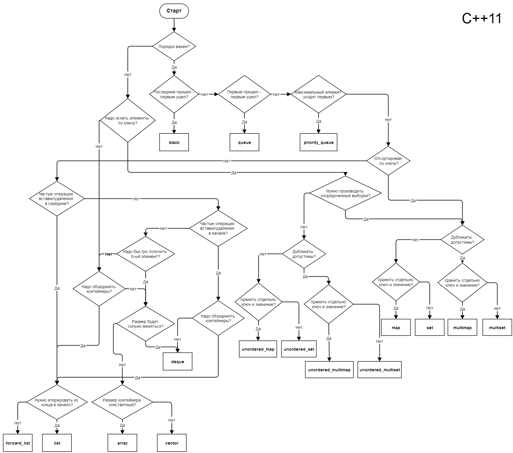

Храмов Арсений Дмитриевич, 0091

# Algorithms

Сборка проекта с помощью cmake:

    git clone https://github.com/Dovgalyuk/Algorithms
    cd Algorithms
    mkdir build
    cd build
    cmake ..
    make

# Требования к лабораторным работам

* Размер вектора должен домножаться на константу в случае его переполнения
* Стек и очередь не должны ограничивать число сохраняемых значений
* Дополнительные требования указаны в комментариях к заголовкам функций

# Материалы для изучения

https://www.youtube.com/watch?v=30PzSv4ZIBU&list=PLoWGNURguz9Xk248HDiJICojc-0rlayUW
https://neerc.ifmo.ru/wiki/index.php?title=%D0%90%D0%BB%D0%B3%D0%BE%D1%80%D0%B8%D1%82%D0%BC%D1%8B_%D0%B8_%D1%81%D1%82%D1%80%D1%83%D0%BA%D1%82%D1%83%D1%80%D1%8B_%D0%B4%D0%B0%D0%BD%D0%BD%D1%8B%D1%85

## Стандартная библиотека C++

http://cppstudio.com/cat/300/

https://habr.com/ru/company/infopulse/blog/194726/

## Время работы алгоритмов

https://www.youtube.com/watch?v=pxR3UoO9c9w
https://www.youtube.com/watch?v=ZRdOb4yR0kk

https://habr.com/ru/company/vdsina/blog/544218/

## Двоичный поиск

https://www.youtube.com/watch?v=4c-jNoIz-uU

## Абстрактные типы данных

* Массив переменного размера
* Абстрактный тип данных "Стек"
* Абстрактный тип данных "Очередь"

https://www.youtube.com/watch?v=XlvdZCkXKL8

## Стековая арифметика. Обратная польская запись

https://www.youtube.com/watch?v=sC566vzV9B0

## Динамическое программирование

https://www.youtube.com/watch?v=f1w6Ac6OEsY
https://www.youtube.com/watch?v=VmocLw9wwM0

## Графы

* Поиск в глубину
* Поиск компонентов связности

https://www.youtube.com/watch?v=-_E4mOMDeGs

## Поиск путей

* Поиск в ширину
* Алгоритм Дейкстры

https://www.youtube.com/watch?v=intKT6COqQY

* Алгоритм Беллмана-Форда
* Определение наличия цикла отрицательного веса в графе
* Кратчайшие пути в ациклических ориентированных графах
* Кратчайшие пути между всеми парами вершин: алгоритм Флойда-Уоршолла, алгоритм Джонсона
* Поиск пути на координатной сетке, волновой алгоритм

https://www.youtube.com/watch?v=cca8QY3tuCI
https://www.youtube.com/watch?v=9ev9Y-hJhj4

## Топологическая сортировка

* Поиск сильно связных компонентов

https://www.youtube.com/watch?v=AYbY8fIDNz4

## Алгоритм Прима для построения минимального покрывающего дерева

https://www.youtube.com/watch?v=vPHUm874EoA
## Алгоритм Крускала для построения минимального покрывающего дерева

https://www.youtube.com/watch?v=94_SkpI4_V8

## Система непересекающихся множеств

https://www.youtube.com/watch?v=-4M5P5af7NE

## Двоичные деревья поиска

* Рандомизированное двоичное дерево поиска
* АВЛ-деревья
* Красно-черные деревья
* Расширяющиеся деревья (splay trees)

https://www.youtube.com/watch?v=RQtdVNIaH6c
https://www.youtube.com/watch?v=ysbq-7IlC3M
https://www.youtube.com/watch?v=RnQYXltlkrI

## Декартовы деревья

https://www.youtube.com/watch?v=aNswE4MlVgM

## Хеш-таблицы. Разрешение коллизий

https://www.youtube.com/watch?v=BtBxtoXBI54
https://www.youtube.com/watch?v=rVr1y32fDI0

https://code-explained.com/

## Двоичные кучи. Очередь с приоритетами

https://www.youtube.com/watch?v=noQ4SUoqrQA
https://www.youtube.com/watch?v=dcG0hvnRi24

## Перебор с возвратом

https://www.youtube.com/watch?v=M66Tit-o6h4
https://www.youtube.com/watch?v=JHzGsqPbEC8

## Жадные алгоритмы

* Задача о выборе заявок
* Код Хаффмена

https://www.youtube.com/watch?v=RBZ8l3k9O4c
https://www.youtube.com/watch?v=aFXFSTIIylU

## Сортировки

* Быстрая сортировка (Хоара)
* Сортировка слиянием
* Сортировка с помощью кучи

https://www.youtube.com/watch?v=cCLSjxrlORM
https://www.youtube.com/watch?v=CKBvzscmwKs

## Поразрядная сортировка

https://www.youtube.com/watch?v=JFUpuzrHB6s

## Алгоритм Кнутта-Морриса-Пратта

* Задача поиска подстроки в строке
* Алгоритм Карпа-Рабина
* Алгоритм Кнута-Морриса-Пратта

https://www.youtube.com/watch?v=kIsPv5XRJgU

# Дополнительные темы

https://habr.com/ru/post/455632/

## Суффиксные деревья

https://www.youtube.com/watch?v=ahgv_eJDhrE

## Компактные структуры данных

https://habr.com/ru/company/mailru/blog/479822/

## Алгоритм A*

https://neerc.ifmo.ru/wiki/index.php?title=%D0%90%D0%BB%D0%B3%D0%BE%D1%80%D0%B8%D1%82%D0%BC_A*
